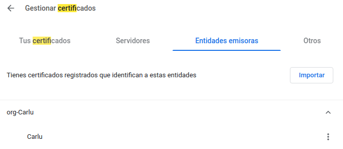
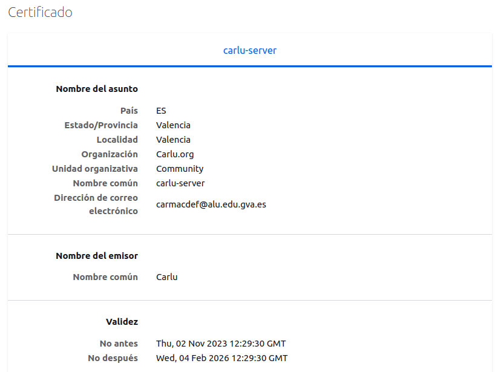
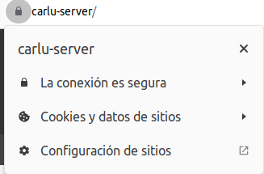
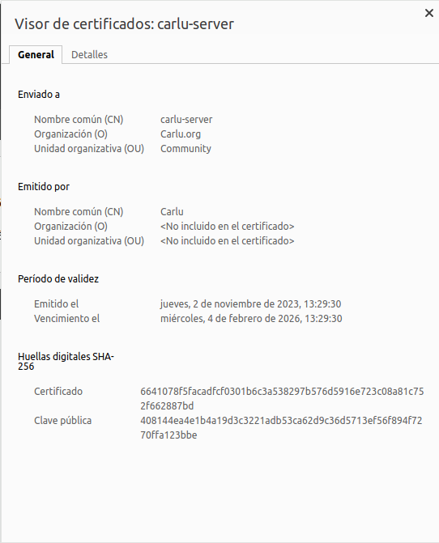

# CERTIFICADO TLS 

## INTRODUCCION 

La seguridad en la comunicación en línea es esencial en el mundo digital actual. Los certificados TLS (Transport Layer Security) juegan un papel crucial al cifrar y asegurar la transferencia de datos a través de Internet, garantizando la privacidad y autenticidad de las conexiones. En esta práctica, exploraremos el proceso de generación de certificados TLS, que son utilizados para habilitar el protocolo HTTPS en servidores web, protegiendo así la información confidencial de los usuarios.

### INSTALACION


### Paso 1: Instalar Easy-RSA

Prime paso es instalar openssl con el comando 
```bash
$sudo sudo apt install easy-rsa
```
Creamos nuestra clave privada 

### Paso 2: Preparar un directorio para la infraestructura de clave pública


```bash
$mkdir ~/easy-rsa
```
Cree los enlaces simbólicos con el comando ln
```bash
$ln -s /usr/share/easy-rsa/* ~/easy-rsa/
```
Con el comando chmod nos aseguraremos de que nadie acceda a el

```bash
$chmod 700 /home/machancoses/easy-rsa
```
inicie la PKI dentro del directorio easy-rsa

```bash
$cd ~/easy-rsa
$/easyrsa init-pki

init-pki complete; you may now create a CA or requests.
Your newly created PKI dir is: /home/machancoses/easy-rsa/pki
```

### Paso 3 - Crear una entidad de certificación

Creamos un archivo llamado vars

```bash
$cd ~/easy-rsa
nano vars
```

Dentro del archivo vars ponemos nuestra configuración en mi caso es esta:

```bash
set_var EASYRSA_REQ_COUNTRY    "ES"
set_var EASYRSA_REQ_PROVINCE   "Valencia"
set_var EASYRSA_REQ_CITY       "Valencia"
set_var EASYRSA_REQ_ORG        "Carlu.org"
set_var EASYRSA_REQ_EMAIL      "carmacdef@alu.edu.gva.es"
set_var EASYRSA_REQ_OU         "machancoses"
set_var EASYRSA_ALGO           "ec"
set_var EASYRSA_DIGEST         "sha512"
```

Para crear el certificado root público y el par de claves privadas para mi entidad de certificación, volvemos a ejecutar el comando ./easy-rsa, aunque esta vez con la opción build-ca:

```bash
./easyrsa build-ca

Common Name (eg: your user, host, or server name) [Easy-RSA CA]:Carlu

CA creation complete and you may now import and sign cert requests.
Your new CA certificate file for publishing is at:
/home/machancoses/easy-rsa/pki/ca.crt
```

Ahora, tenemos dos archivos importantes, `~/easy-rsa/pki/ca.crt` y `~/easy-rsa/pki/private/ca.key`.

El ca.crt es el archivo del certificado público de la CA y ca.key es la clave privada que usa la CA para firmar certificados para servidores y clientes.

### Paso 4: Distribuir el certificado público de su entidad de certificación

Hacemos un cat en el archivo `~/easy-rsa/pki/ca.crt` y nos saldrá algo parecido a esto:

```bash
-----BEGIN CERTIFICATE-----
MIIDOTCCAiGgAwIBAgIULGbMiEaoa1oM56jYAEUXiVyw1t0wDQYJKoZIhvcNAQEL
BQAwEDEOMAwGA1UEAwwFQ2FybHUwHhcNMjMxMTAyMTIwMDAxWhcNMzMxMDMwMTIw
MDAxWjAQMQ4wDAYDVQQDDAVDYXJsdTCCASIwDQYJKoZIhvcNAQEBBQADggEPADCC
AQoCggEBALLne6NkoDoDUpAVo6XD5vu9GRDvzwZ1HQddLIwFJr3oA1DQ0OQbeJh+
cDSMfLK32pRhn1s00fT6ZB9hIOoI+Rc7dJQjMdcjZHcU9jYP1GDr2jRhZZAJhu+X
STCQCjSqlRNJE4i7F4IyDpeLzUSi8jAHq+KKSravLm1DNPCCSqZ8EQWugZN8yGOZ
CXV5uENKjm4usg+Qr1fTsJVJsX2/ZtsflNFJhxL5MjyyiLTfxQLibvdH3WtJrBco
HOmPUJdXyQgMLPNcY8k5wmRM+tSfpaTJ/mS8qE9KcmDEyeWQnS6h//RKW1eDOzou
fyBkmSJ4IMR8cnvel6V7krj9dmOL6JsCAwEAAaOBijCBhzAdBgNVHQ4EFgQUEfVx
s+oSoT4PClT6Hh3HHWzcqhgwSwYDVR0jBEQwQoAUEfVxs+oSoT4PClT6Hh3HHWzc
qhihFKQSMBAxDjAMBgNVBAMMBUNhcmx1ghQsZsyIRqhrWgznqNgARReJXLDW3TAM
BgNVHRMEBTADAQH/MAsGA1UdDwQEAwIBBjANBgkqhkiG9w0BAQsFAAOCAQEAR+9D
RoFHHU8botTvh0UsSchkCQllAE70xG/sttPajXGcBxSrmgW1vXopjroW3liGKH1v
86wZoquTk8p8+VJgZA1azwI657lKe1bujCBH2i69k6dpNdVhMOleFiURkxYJdgvd
TNgMhN0zrNS2u7n+t9eoMziiPZzAx/QGkMASS5nSeQU0nLdfLZymr78lmiAn/fM0
jrs22cAC/8dAL9BSdQ0kVDpfHbkihdPdeYba2OYhc3lK2zNikSCW4Myb5dv51399
JdqjM1IVX1JlKxK0ZqXYJN5ri6NTzBF9rsas9/xjfvO66MAdYUSQaDqoZhMH6vag
YxFMOiSqZTM73pL/6g==
-----END CERTIFICATE-----
```
Ahora creamos un archivo llamado `ca.crt` en el directorio /tmp y copiamos el texto que no has dado anteriormente.

El siguiente paso es hacer una copia del fichero 
```bash
sudo cp /tmp/ca.crt /usr/local/share/ca-certificates/
```

Importamos el certificado con el comando
```bash
sudo update-ca-certificates
Updating certificates in /etc/ssl/certs...
rehash: warning: skipping ca-certificates.crt,it does not contain exactly one certificate or CRL
1 added, 0 removed; done.
Running hooks in /etc/ca-certificates/update.d...
done.
```

### Crear CSR 

Primero instalamos openssl 
```bash
$sudo apt install openssl
```

El primer paso para crear una CSR es generar una clave privada. Para crear una clave privada usando openssl, creamos un directorio practice-csr

```bash
$mkdir ~/practice-csr
$cd ~/practice-csr
openssl genrsa -out carlu-server.key
$cat carlu-server.key
```
Ahora que tenemos la clave privada, vamos a crear un CSR y vovler a usar openssl

```bash
openssl req -new -key carlu-server.key -out carlu-server.req
You are about to be asked to enter information that will be incorporated
into your certificate request.
What you are about to enter is what is called a Distinguished Name or a DN.
There are quite a few fields but you can leave some blank
For some fields there will be a default value,
If you enter '.', the field will be left blank.
-----
Country Name (2 letter code) [AU]:ES
State or Province Name (full name) [Some-State]:Valencia
Locality Name (eg, city) []:Valencia
Organization Name (eg, company) [Internet Widgits Pty Ltd]:Carlu.org
Organizational Unit Name (eg, section) []:Community
Common Name (e.g. server FQDN or YOUR name) []:carlu-server
Email Address []:carmacdef@alu.edu.gva.es

Please enter the following 'extra' attributes
to be sent with your certificate request
A challenge password []:student
An optional company name []:student
```

Ahora copiamos al directorio /tmp

```bash
$cp carlu-server.req /tmp/carlu-server.req
```

### Firmar CSR

Importamos la solicitud de certificado usando la secuencia de comandos easy-rsa
```bash
cd ~/easy-rsa

./easyrsa import-req /tmp/carlu-server.req carlu-server

Using SSL: openssl OpenSSL 3.0.2 15 Mar 2022 (Library: OpenSSL 3.0.2 15 Mar 2022)

The request has been successfully imported with a short name of: carlu-server
You may now use this name to perform signing operations on this request.
```

Ahora vamos a firmar, nos saldrá un mensaje de confirmación

```bash
./easyrsa sign-req server carlu-server

Certificate created at: /home/machancoses/easy-rsa/pki/issued/carlu-server.crt
```

### Configurar el sitio de apache

Editamos el fichero`/etc/apache2/sites-available/default-ssl.conf` y editamos las siguiente líneas:

SSLCertificateFile      /etc/ssl/certs/carlu-server.crt
SSLCertificateKeyFile /etc/ssl/private/carlu-server.key

Ahora tenemos que activar el sitio apache con el comando 

```bash
sudo a2ensite default-ssl
```
Y reiniciamos

```bash
sudo systemctl restart apache2
```
### COMPROBACION
Comprobamos en el navegador que nuestra entidad es de confianza:





Tenemos que editar el fichero `etc/hosts` para añadir nuestra ip y nuestros nombre de certificado:

```bash
10.0.2.15       carlu-server
```

Por último entramos en el navegador un ponemos http://carlu-server y podremos observar que ya lo reconoce como sitio seguro.






