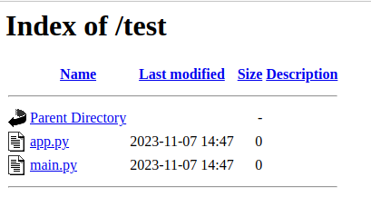
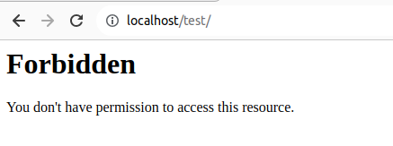

# Hardening Apache


### 1. Esconder la versión de apache

Vamos al archivo `/etc/apache2/apache2.conf` y añadimos la suiguientes líneas:

ServerTokens Prod
ServerSignature Off


### 2. Desactivar el listado de directorios de Apache:

Creamos un directorio llamado prueba y creamos algun archivo:

```bash
$sudo mkdir -p /var/www/html/test
$sudo touch app.py main.py
```
Accedemos a la página y podemos ver el listado del directorio:



Vamos al fichero de configuración `apache2.conf` y añadimos las siguientes líneas 

```bash
<Directory /var/www/html/test>
Options -Indexes
</Directory>
```

Una vez añadimos la línea reiniciamos y no nos deja ver los directorios:




### 4. Proteger apache con HTTPS

Editamos el fichero`/etc/apache2/sites-available/default-ssl.conf` y editamos las siguiente líneas:

SSLCertificateFile      /etc/ssl/certs/carlu-server.crt
SSLCertificateKeyFile /etc/ssl/private/carlu-server.key

Ahora tenemos que activar el sitio apache con el comando 

```bash
sudo a2ensite default-ssl
```
Y reiniciamos

```bash
sudo systemctl restart apache2
```

### 5. Hablitiar HSTS (Strict-Transport-Security )

Habilitar el módulo header:

```bash
$sudo a2enmod headers
```
Acceder a nuestra configuración de host virtual y añadir la siguiente línea:

```bash
<VirtualHost *:443>
        # .....
        # ....
        Header always set Strict-Transport-Security "max-age=31536000; includeSubDomains"
</VirtualHost>
```
 Y reniciamos apache `sudo systemctl restart apache2`


### 8. Deshabilitar la directiva 'ServerSignature'.

Desactivar la siguiente directiva:

```bash
ServerSignature Off

```

### 9. Establezca la directiva 'ServerTokens' en 'Prod'

La directiva ' ServerTokens ' controla qué información envía el servidor, incluida la versión de Apache.

Accedemos al fichero de configuración de apache y añadimos la siguiente línea.

```bash
ServerTokens Off
```

### 11. Deshabilitar modulos innecesarios.

Para ver los módulos habilitados usamos el comando `sudo apache2ctl -M`

Y para deshabilitar el módulo ejecutar el siguiente comando:

```bash
$sudo a2dismod rewrite 
```

### 14. Limitar el tamaño de carga de archivos en Apache


En el archivo /etc/apache2/apache2.conf añadimos la siguiente línea:

```bash
<Directory "/var/www/domain.com/wp-uploads">
	LimitRequestBody  4194304
</Directory>
```

Reiniciamos apache:

```bash
$sudo systemctl restart apache2
```

### 16. Ejecutar Apache como usuario y grupo separados

Primero creamos un nuevo usuario y grupo para Apache

```bash
$sudo groupadd apachegroup 
$sudo useradd -g apachegroup apacheuser
```

Editar el archivo de configuración de Apache para especificar el nuevo usuario y grupo.

```bash
User apacheuser
Group apachegroup
```

Y reiniciamos apache:

```bash
sudo systemctl restart apache2
```

### 17. Protejer los ataques DDOS y el endurecimiento

No se puede proteger completamente tu sitio web de ataques DDoS. Pero puede mitigarse configurando las siguientes líneas:

```bash
# Timeout 300, esta directiva le permite especificar el tiempo que el servidor esperará a que se completen ciertos eventos antes de devolver un error. 

# KeepAliveTimeout 5, esta directiva especifica el tiempo que el servidor esperará una solicitud posterior antes de cerrar la conexión.

# MaxClients : esta directiva establece el límite en la cantidad de conexiones que se pueden atender simultáneamente.
```


